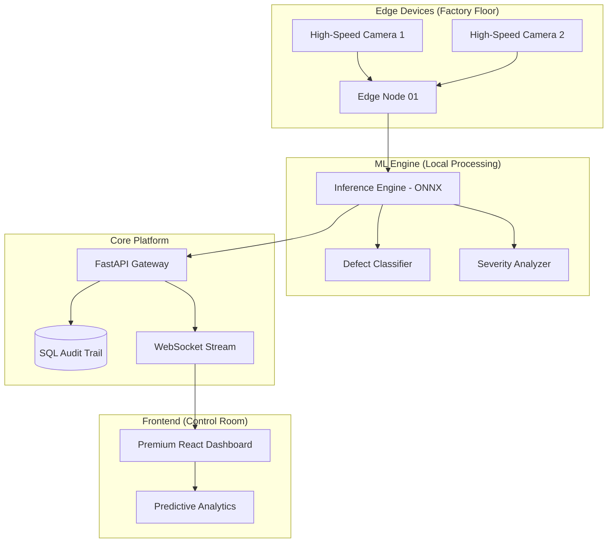

# 🦾 SteelHack: Autonomous Steel Quality Intelligence

[](https://opensource.org/licenses/MIT)
[](https://react.dev/)
[](https://fastapi.tiangolo.com/)
[](https://tailwindcss.com/)
[](https://en.wikipedia.org/wiki/Fourth_Industrial_Revolution)

> **Premium Industrial Intelligence Platform for Real-Time Steel Surface Inspection & Predictive Maintenance.**

SteelHack is a high-throughput, AI-powered industrial platform designed for the Tata Steel AI Hackathon. It leverages deep learning at the edge to detect surface defects with sub-50ms latency, providing actionable insights for factory-wide operational excellence.

---

## 📸 Screenshots

| Landing Page (Cinematic) | Industrial Dashboard | Live Monitoring |
| :--- | :--- | :--- |
|  |  |  |

*(Note: Add actual screenshots to `assets/screenshots/` for final submission)*

---

## 🏗️ System Architecture



---

## 🛠️ Project Structure

```text
SteelHack/
├── client/              # React 19 + Tailwind 4 Frontend
│   ├── src/             # Industrial UI Components & Logic
│   └── public/          # Static Assets
├── server/              # FastAPI Backend
│   └── app/             # API Routes & Database Schema
├── ml_engine/           # Machine Learning Pipeline
│   ├── model.py         # Torch/ONNX Model Definitions
│   └── train.py         # Training Scripts
├── scripts/             # Deployment & Docker Configs
├── assets/              # Branding & Screenshots
└── docs/                # Extended Documentation
```

---

## ⚡ Quick Start

### Prerequisites
- Node.js 20+
- Python 3.10+
- Docker (optional)

### Installation

1. **Clone the Repository**
   ```bash
   git clone https://github.com/Pavan3030-pr/SteelHack.git
   cd SteelHack
   ```

2. **Environment Setup**
   ```bash
   cp .env.example .env
   ```

3. **Frontend Setup**
   ```bash
   cd client
   npm install
   npm run dev
   ```

4. **Backend Setup**
   ```bash
   cd server
   pip install -r requirements.txt
   uvicorn app.main:app --reload
   ```

---

## 🔑 Demo Credentials

| Role | Email | Password |
| :--- | :--- | :--- |
| **Ops Commander** | `admin@steelhack.ai` | `tata-steel-2024` |
| **Shift Lead** | `operator@steelhack.ai` | `op-secure-access` |

---

## 📡 API Documentation

SteelHack exposes a RESTful API with real-time WebSocket support for telemetry.

- **Docs URL**: `http://localhost:8000/docs` (Swagger)
- **Base Endpoint**: `/api/v1`
- **Key Routes**:
    - `POST /audit/inspect`: Submit image for AI classification.
    - `GET /telemetry/live`: WebSocket for live factory metrics.
    - `GET /analytics/severity`: Retrieve defect distribution reports.

---

## 🚢 Deployment

### Using Docker
```bash
cd scripts
docker-compose up --build
```

---

## 🤝 Contributing
1. Fork the Project
2. Create your Feature Branch (`git checkout -b feature/AmazingFeature`)
3. Commit your Changes (`git commit -m 'Add some AmazingFeature'`)
4. Push to the Branch (`git push origin feature/AmazingFeature`)
5. Open a Pull Request

---

## ⚖️ License
Distributed under the MIT License. See `LICENSE` for more information.

---

**Handcrafted with precision for the Tata Steel AI Hackathon 2024.**
